## Project Overview

The purpose of this projects is to evaluate machine learning models (Scikit-learn) in order to assess their performance in predicting of a Lending Club a peer-to-peer lending company.

## Ressources:

- Data Source (root folder): LoanStats_2019Q1.csv

- Software: Python 3.7 (sklearn, imblearn, numpy, pandas), Anaconda Navigator, Conda, Jupyter Notebook

## Results

### Oversampling

The idea is simple and intuitive: If one class has too few instances in the training set, we choose more instances from that class for training until it's larger.

#### Naive Random Oversampling

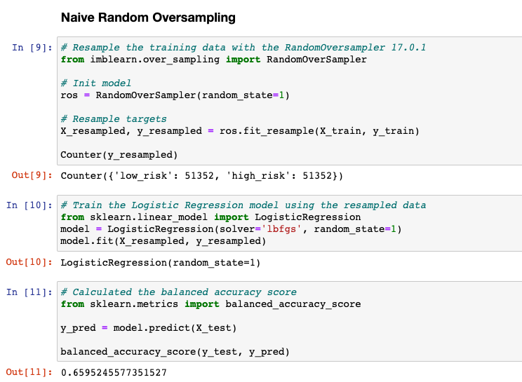

- The balanced accuracy score is 66%.

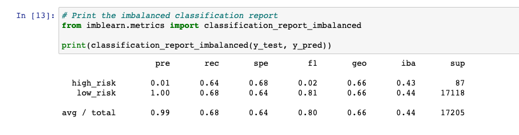

- The high_risk precision is about 1% with 64% sensitivity which makes a F1 of 2% (trade-off)

- The low_risk precision is about 100% with 68% sensitivity which makes a F1 of 68% (trade-off)

- Accuracy: 66%, Precision: High Risk: 1%, Low Risk: 100%, Recall: High Risk: 64%, Low Risk: 68%

#### SMOTEENN algorithm to Predict Credit Risk

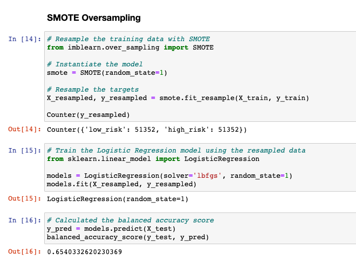

- The balanced accuracy score is 65%.

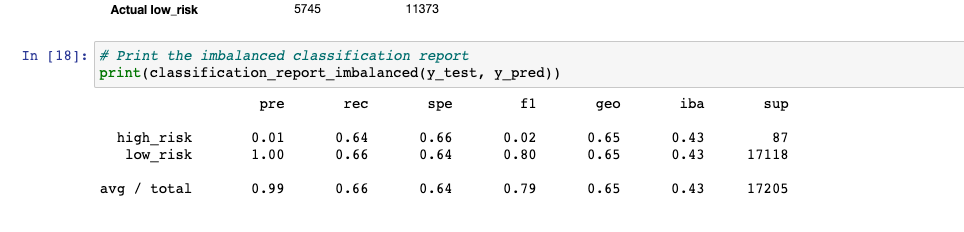

- The high_risk precision is about 1% with 64% sensitivity which makes a F1 of 2% (trade-off)

- The low_risk precision is about 100% with 66% sensitivity which makes a F1 of 80% (trade-off)

Accuracy: 65%, Precision: High Risk: 1%, Low Risk: 100%, Recall: High Risk: 64%, Low Risk: 66%

### Undersampling

Undersampling takes the opposite approach of oversampling. Instead of increasing the number of the minority class, the size of the majority class is decreased.

#### ClusterCentroids model to Predict Credit Risk

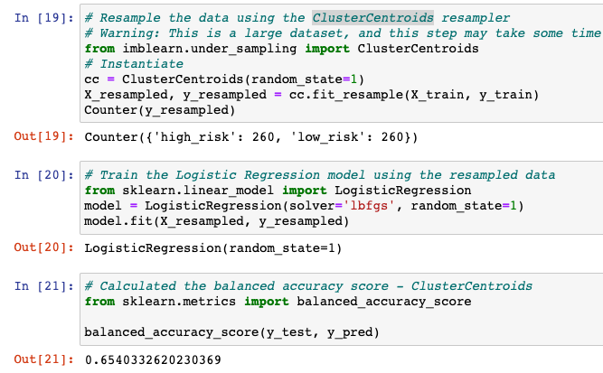

- The balanced accuracy score is 65%.

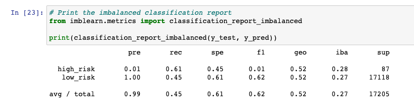

- The high_risk precision is about 1% with 45% sensitivity which makes a F1 of 1% (trade-off)

- The low_risk precision is about 100% with 61% sensitivity which makes a F1 of 62% (trade-off)

- Accuracy: 65%, Precision: High Risk: 1%, Low Risk: 100%, Recall: High Risk: 61%, Low Risk: 45%

### Combination Sampling

As previously discussed, a downside of oversampling with SMOTE is its reliance on the immediate neighbors of a data point. Because the algorithm doesn't see the overall distribution of data, the new data points it creates can be heavily influenced by outliers. This can lead to noisy data. With downsampling, the downsides are that it involves loss of data and is not an option when the dataset is small. One way to deal with these challenges is to use a sampling strategy that is a combination of oversampling and undersampling.

#### Ensemble Classifiers to Predict Credit Risk

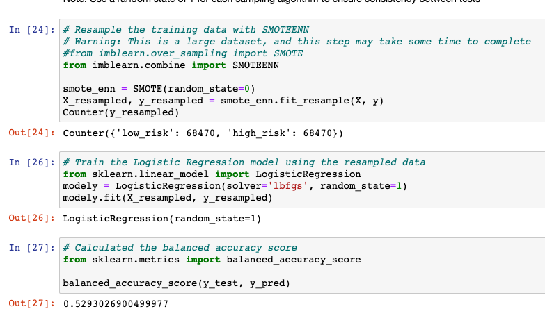

- The Ensemble Classifiers accuracy score is 53%.

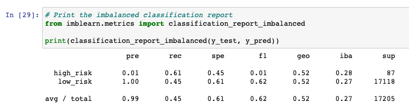

- The high_risk precision is about 1% with 45% sensitivity which makes a F1 of 1% (trade-off)

- The low_risk precision is about 100% with 61% sensitivity which makes a F1 of 62% (trade-off)

Accuracy: 53%, Precision: High Risk: 1%, Low Risk: 100%, Recall: High Risk: 61%, Low Risk: 45%

### Ensemble Learners

#### Balanced Random Forest Classifier

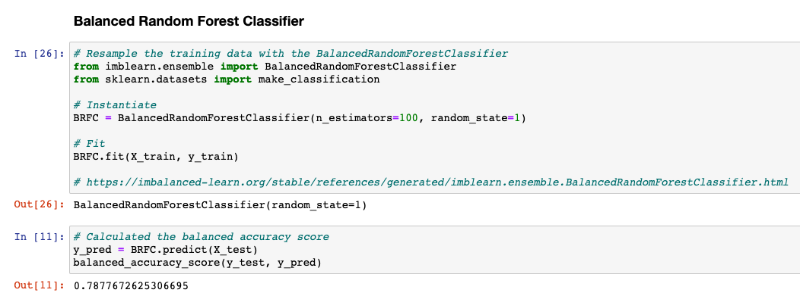

- The Ensemble Classifiers accuracy score is 79%.

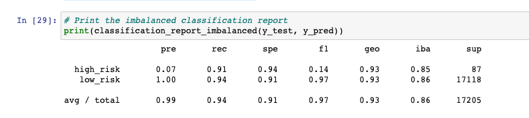

- The high_risk precision is about 7% with 94% sensitivity which makes a F1 of 14% (trade-off)

- The low_risk precision is about 100% with 91% sensitivity which makes a F1 of 97% (trade-off)

Accuracy: 79%, Precision: High Risk: 7%, Low Risk: 100%, Recall: High Risk: 94%, Low Risk: 91%

#### Easy Ensemble AdaBoost Classifier

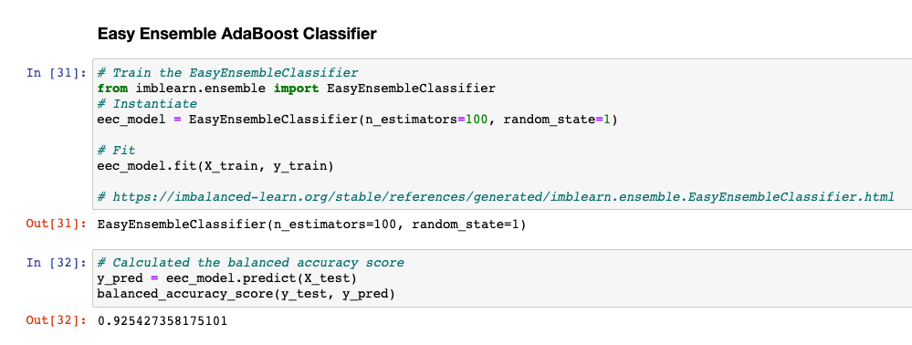

- The Ensemble Classifiers accuracy score is 93%.

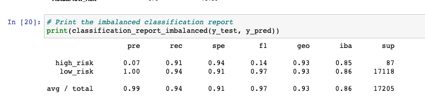

- The high_risk precision is about 7% with 94% sensitivity which makes a F1 of 14% (trade-off)

- The low_risk precision is about 100% with 91% sensitivity which makes a F1 of 97% (trade-off)

Accuracy: 93%, Precision: High Risk: 7%, Low Risk: 100%, Recall: High Risk: 94%, Low Risk: 91%

## Summary

- Oversampling, undersampling, and combination models returned around 65% accuracy scores with only 1% of credit being returned as high risk. They also have low percentages on recall of credit being accurately evaluated.

- The balanced random forest classifier had a 78% accuracy score and returned 7% credit as high risk, but the recall of high risk and low risk credit showed a 25% variance.

- Finally, the model I recommend for evaluating credit riskiness is the Easy Ensemble AdaBoost Classifier. It returns an accuracy of 93%, 7% of the credit were high risk, and the recall for high risk and low risk cards were 91% and 94% (This model improve on the sensitivity of the high risk credits and shows a recall of 91% so it detects almost all high risk credit).

- In conclusion, combining multiple models increases the performance and accuracy
